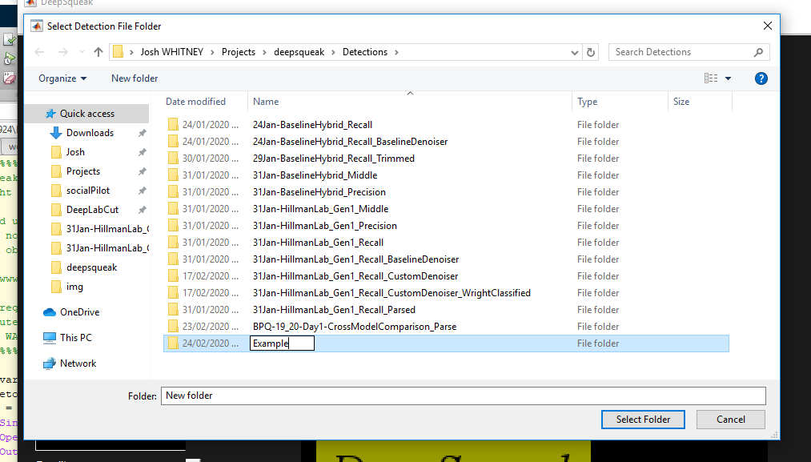
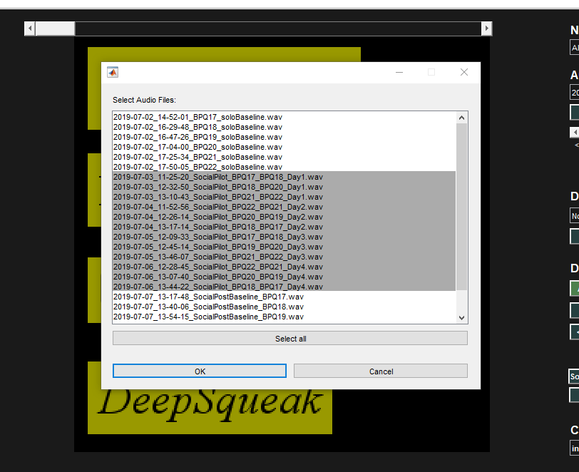
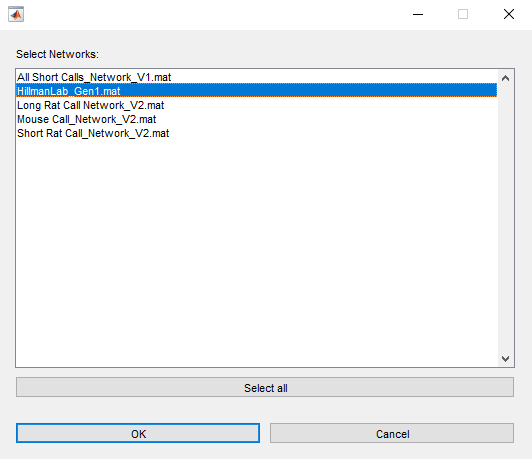
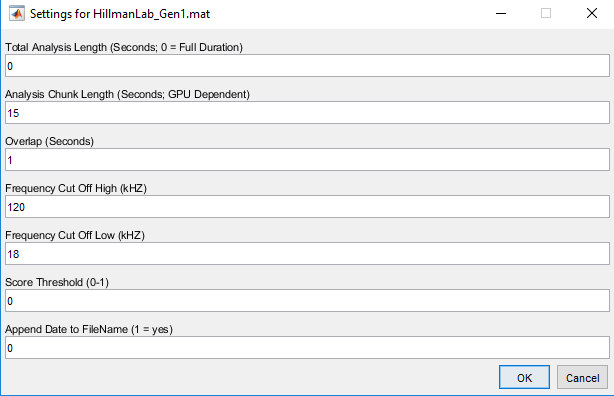
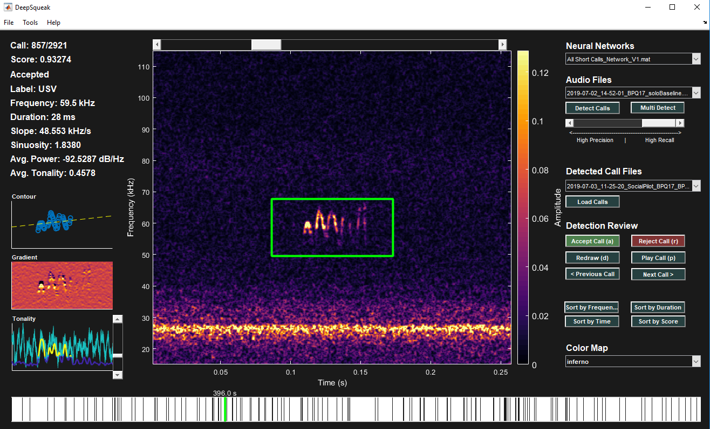
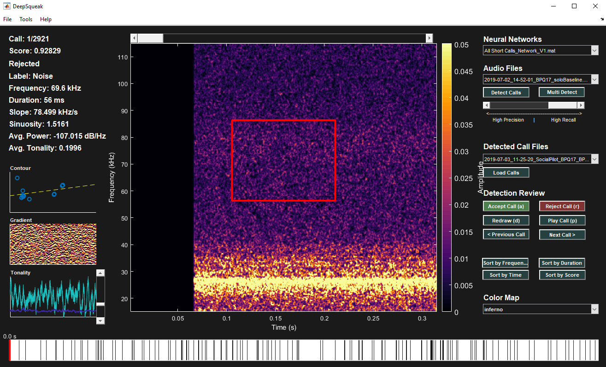

# Analyzing audio with an existing DeepSqueak network

This is a short guide intended to walk someone through the process of using a DeepSqueak network (which has already been prepared) to analyze new sound clips. To see how to train your own custom network, go [here](./squeaktrain.md).

## Opening things up
For the purposes of demonstration; I'll be using the HillmanLab_Gen1 network I've already made; which should all already be contained in ```S:\Kristin Hillman\LAB\Lab members\Josh\deepsqueak```; and the sample audio files I'll be looking at are in ```S:\Kristin Hillman\LAB\Lab members\Josh\sourceData\pilotWAV```. 

First; we'll be looking inside the main deepsqueak folder, and opening up *DeepSqueak.m*. We won't need to be doing any serious coding in here, we're just going straight to the Command Window and entering: ```DeepSqueak```, which should give us a screen something like this:


Don't worry too much if the image in the middle or anything else doesn't match; as long as the window shows up. Now we have to set up our folders. Go to menu at the top left; and select ```File > Select Network Folder```. We're going to be navigating to wherever your premade network is stored; I've stored mine conveniently in the default *deepsqueak/Networks* folder along with the default networks. Select the folder, and we'll see our Neural Networks list in the top-right updated with the contents of the folder: 

 


Next is selecting ```File > Select Audio Folder```; in which we'll be picking whatever folder our raw audio files are in, so mine in this case are in *sourceData/pilotWAV*. When we select the folder, it'll update our Audio Files list similarly. Then we're going to do the same for ```File > Select Detection Folder```; Except this time we're going to make a new folder, which is where all of our analyzed output files are going to go. Personally I wouldn't reccomend dumping all of these in a single folder, organize them a bit and come up with some naming conventions. I'm going to make a new folder and use that:



Note that there won't be anything in our Detected Call Files list yet.

## Detection

Depending on the type of network you're using; and how sensitive it might be, you'll be setting the precision/recall slider differently; For the HillmanLab_Gen1 network I suggest High Recall. I also reccomend this in general for the first part, as we'll be using a denoiser later anyway, so at this stage we're looking to minimize the number of **False Negatives** we have. Treating each stage of this analysis as a seive, we'd rather be generous with accepting things that are *probably* USVs, and filter out the True Negatives later; rather than try and be oversensitive when trying to pick up calls and missing out many True Positives which we can't get back during denoising.

So now, **before starting detection** we have to select the sensistivty on this little slider bar:


It's a little unintuitively placed here and not somewhere in the menus later on in the process, but that's what we have to work with. There's only three settings: High Precision, High Recall, and Middle. We're going with High Recall.

From here we can choose to either ```Detect Calls```, which has some more advanced options for analysing a single file, which may be worth exploring seperately. But for mass data analysis of many files, we're going with ```Multi Detect```. Inside the audio selection window, you can hold **Ctrl** or **Shift** while clicking on entries to select multiple files at once; or just the **Select All** button.



Now we select the network(s) to use. You can select **up to two** at a time (although this limit isn't noted in the window, and despite having a "Select All" button), much the same as you could multi-select audio files; for example if you wanted to look at *all* rat calls, you could select both *Short Rat Call_Netowrk_V2.mat* **and** *Long Rat Call_Network_V2.mat*. In my case however, I've already trained a single network to look for every kind of call I want, so I'll select HillmanLab_Gen1.mat.



On the following screen, we can select a few more options regarding our audio files:
- **Total Analysis Length**: How many seconds of each video to scan through; I want the whole clip so I choose ```0```.
- **Analysis Chunk Length**: This allows us to have the network analyse larger chunks at once, but for now we'll stick with the default.
- **Overlap**: How much overlap is between each chunk, go with about the length of the longest call you're expecting, ```1``` is fine here.
- **Frequency Cut Offs**: The upper and lower bounds of the frequency range for your audio files, I just stick with defaults.
- **Score Threshold**: If we wanted to tigten things up to make sure we only get calls when the network is really sure it's a call (giving it a higher score), we could set a custom value, but since we're denoising later anyway, we'd still prefer to minimize **False Negatives** for now.
- **Append Date to Filename**: Because my audio files already have a nice naming convention, I'm going with No; ```0```.



After that, you'll be processing for a while. Depending on the computer you're using, how many files you're analyzing, what settings you selected; this could take minutes or hours. On a computer with a Nvidia 1050Ti 4GB, doing the single file I'm using in this example took about 10 minutes. As files complete, you'll see the number of calls detected show up in the Matlab Command Window, mine showed ```2921 Calls found in: 2019-07-03_11-25-20_SocialPilot_BPQ17_BPQ18_Day1 ```. You'll also notice after all the files are finished processing, your selected Detection folder will now have files in it; and the Detected Call Files list will have things in it now.


- Optionally, feel free to pick a Detected Call File from the list and hit ```Load Calls```; to see something like the images below, on the left is an image of a (clearly) **False Positive** call, and on the right a **True Positive**. Don't worry about that too much yet though.

 



Some interesting things to look at here, in the top left and center mainly:
- **Call**: The number of the call you're looking at obviously, you can scroll through them with your arrow keys, or the ```Previous Call``` and ```Next Call``` buttons on the middle right.
- **Score**: This number represents how certain the network is that there is actually a call in the green box on the image; This number is a probability ranging from zero to one. The **Score Threshold** we looked at in the Multi-Detect options earlier refers to this number, such that any call that falls below the threshold you set, will be ignored instead.
- **Accepted**: This means that the network has "accepted" that there is a call in the box. All of the calls will have this flag at this stage.
- **Label: USV**: The label isn't really important here yet, as all of them will have been labelled as USVs.
- **Others**: Everything else is fairly intuitive data on the individual call.

You'll probably notice if you scrolled through that there's probably a good number of **False Positives**, which is what we're going to filter out now.

## Denoising

The Detection Network we just used is on that is specialized at picking out **calls-amongst-noise**, but inevitably this comes with the large number of **False Positives** or **Noise**, which messes with our data. So we use this Denoiser Network, which is specialized at picking out **noise-amongst-calls** and marking them as such, so that we can remove them. Think of this as using a large grain seive for the Detection Network - good at really getting out all the big long strips of nothing that our files are going to be full of, but let smaller patches of nothing slip through. Now a much finer grain seive for the Denoiser can be much more sensitive, specialized at very efficiently getting out the last little imperfections from a dataset that has *already* had the big chunks removed.

The first thing to be done here is make sure that we're using the right Denoising Network. There's no interface for this, we have to just open an explorer window (```Windows + E```) and navigate to our *deepsqueak* folder, and look at **Denoising Networks**. Now whichever file in the top of this folder is called "CleaningNet.mat" will be used. Notice that I've created two folders in here, a backup of the DefaultCleaner that comes with DeeqSqueak, and *HillmanDenoiser* which is the one I've already trained. Inside each of these is another "CleaningNet.mat". I'm going into the *HillmanDenoiser* folder and copying out the network in there to the *Denoising Networks* folder.


Then we go back to the DeepSqueak window and look for ```Tools > Automatic Review > Post Hoc Denoising```. Much like with detection, we can select any number of files to Denoise, and clicking OK will start the process immedeatley. This won't take as long as detecting, but can still take a while.

Now as seen below, after denoising is finished we can go back and reopen the same Detected Call File; and we'll notice pretty quickly by scanning through the calls that many of the **False Positives** have now been given the *Rejected* flag, and the *Noise* label; Not to mention the menacing red box around the call. Note none of the boxes will have been adjusted either.



Optionally here, you can choose to have all the now rejected calls removed from the file entirely; with the ```Tools > Automatic Review > Remove Rejected Calls``` button. I believe this only works on the file you currently have open, so you'll have to do it for each file in the Detected Call Files list; but it's well worth it for the saved space and processing time later; see how many calls have been trimmed from the file:


## How do I actually analyze any of this?

As much as looking at all the nice pictures of sound waves is nice, the whole point of all this is that we can mass-analyze data without having to look at each sound file. Luckily DeepSqueak puts all of our stuff into neat little MatLab-ready files. By opening an explorer window (```Windows + E```) and navigating to our Detections folder, we can see that each of those Detected Call Files in the list is actually its own Matlab file: 


By just double-clicking any single one of them, we can import it into Matlab as a struct. You'll have to wait a second for it to load, as the files get quite large. You're also able to import the variables into MatLab using any of your own scripts as well of course, but for now we'll just do one:


By going over to the right and clicking on the "Calls" table in the Workspace Variables, we'll see the table above which I'll break down as follows:
- **Rate**: The Sampling Rate of the audio file
- **Box**: This is the position of the call-detection boxes, as if the entire audio file were stitched together in one long graph, with each column details as follows (In Order):
  - First column is **Time** in seconds, as in the *left-most edge* of the drawn box.
  - Second column is **Base Frequency** in kHz, as in the *lowest edge* that the drawn box touches.
  - Third column is **Duration** in seconds, or the *length* of the box. 
  - Fourth column is **Amplitude** in kHz, as in the *height* of the drawn box. 
- **RelBox**: This is similar to Box except is "Relative" to the window in which the drawing of the wave is shown on the DeepSqueak window, this is probably unimportant to analysis
- **Score**: Again, the Network's proposed "likelihood" of a call truly being in the given box.
- **Audio**: The actual binary of the audio clip.
- **Type**: The "Label" field, usually you'll see mostly USV here, or Noise if you used the Denoiser, and sometimes numbers or other labels if you experiment with the Classification (which I have in the above image, but sadly don't have the experience with to confidently make a guide on)
- **Power**: Math stuff?
- **Accept**: Always either a 1 (for Accepted) or 0 (for Rejected), as to whether the call was accepted or not.

As this is already formatted as a Matlab table, these variables are already in great condition to use out-of the box, although it's maybe wise to prune out the irrelevant columns like RelBox and maybe even the Audio. Other than that, these should all be ready to integrate straight into your existing analysis scripts!

## If you made it this far
Thanks for actually reading all of that, I hope it's enough to get people going with the basics of running Audio files through deepsqueak. There'll be another guide [here](./squeaktrain.md) on how to train your own, and if there are any errors or clarifications needed, I'm almost always available by email at joshwhitney789@gmail.com.
