# Training your own custom DeepSqueak network

This is a short guide intended to walk someone through the process of training a tailored DeepSqueak network, specialized at identifying USVs in whatever unique soundscape you're trying to analyze. This guide also has the dual purpose of documenting how I trained my own network for use in the Hillman Lab at the University of Otago.

## Getting Started
For the purposes of demonstration; I'll be using the HillmanLab_Gen1 network I've already made; which should all already be contained in ```S:\Kristin Hillman\LAB\Lab members\Josh\deepsqueak```; and the sample audio files I'll be looking at are in ```S:\Kristin Hillman\LAB\Lab members\Josh\sourceData\pilotWAV```. 

First; we'll be looking inside the main deepsqueak folder, and opening up *DeepSqueak.m*. We won't need to be doing any serious coding in here, we're just going straight to the Command Window and entering: ```DeepSqueak```, which should give us a screen something like this:


Don't worry too much if the image in the middle or anything else doesn't match; as long as the window shows up. Now we have to set up our folders. Go to menu at the top left; and select ```File > Select Network Folder```. We're going to be navigating to  *deepsqueak/Networks* folder along with the default networks. Select the folder, and we'll see our Neural Networks list in the top-right updated with the contents of the folder: 

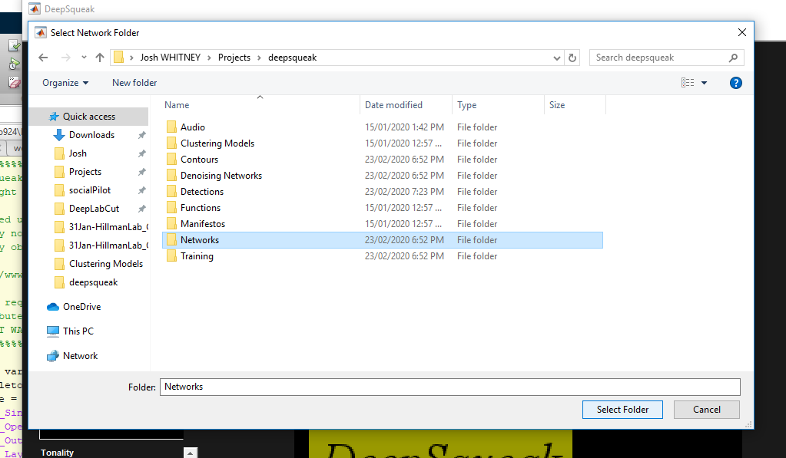


Next is selecting ```File > Select Audio Folder```; in which we'll be picking whatever folder our raw audio files are in, so mine in this case are in *sourceData/pilotWAV*. When we select the folder, it'll update our Audio Files list similarly. Then we're going to do the same for ```File > Select Detection Folder```; Except this time we're making a new folder somewhere to put our first training outputs, which I'm going to name *Date-BaselineHybrid_Recall*, which I'll explain shortly:

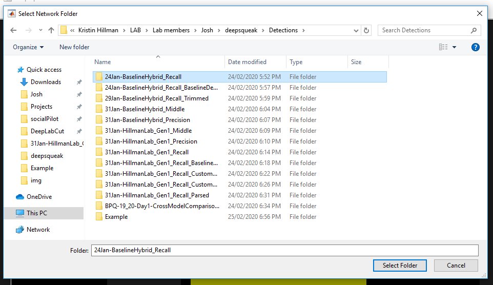

## Creating a Baseline Sample

For us to be able to actually train out network, we're going to need to create some sample data for DeepSqueak to use for training; which we'll do by using DeepSqueak's default network.

Start by going to the top-right and ***first*** changing the sensitivity of the baseline networks, on the little slider they have: 

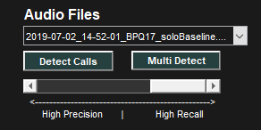

It's important we do this step first, as after we do the ```Multi-Detect``` step, we can't change this setting. It's a little unintuitively placed (we'd normally expect it in the detection options), so it's importaant we remember to check this before any detection.

We're going with ```High Recall``` here (which is why I added the "_Recall" suffix to the folder name), because we want the most generalisable sample we can get. This means we want to be as sure as possible that our sample includes even the most faint looking USVs. 

### Why use High Recall?

 - If you're curious, I also took to trying all three of the different settings on this slider, which are viewable in the folders ```S:\Kristin Hillman\LAB\Lab members\Josh\deepsqueak\Detections\31Jan-BaselineHybrid_Middle``` and ```...\31Jan-BaselineHybrid_Precision```: 

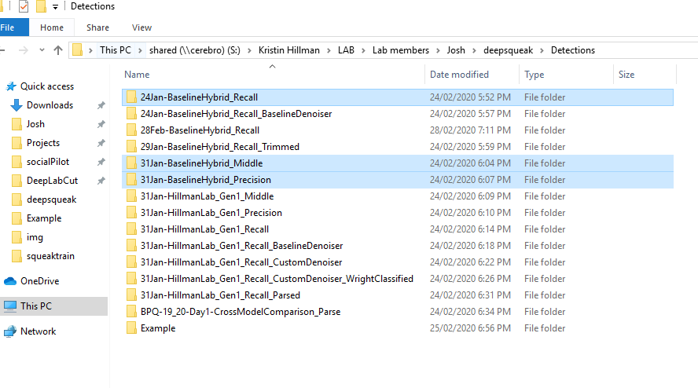

 - By opening up any of these folders using ```File > Select Detection Folder```, and loading the different Detected Call Files (on the middle-right of the DeepSqueak window), you can compare and see how sensitive each of these different settings were, despite all being used on the same network. For reference; here's a table that shows the number of calls detected by each sensitivity in each file:

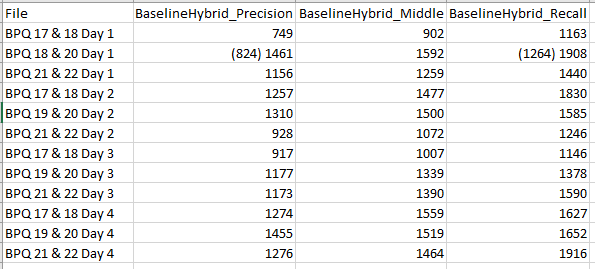

 - While it seems like the more precise network here would make more sense, I've tried to demonstrate here that an untuned "precise" network is actually just going to prune off real calls. The two bracketed numbers on the table represent two files I went through and manually counted how many "real" calls were in the file. While intuitively one might think that the Precise network with 1461 Calls would have found all 1264 of the Recall network's *"true"* calls, actually it cut off many of the true calls as well, leaving us with only 824. 
 
### Continuing...

So because we want the most generalizeable sample, we want to go with the sensitivity that will give us the most "true" calls; ```Recall```. And from there, we're going with ```Multi Detect```. From the window that shows up there, you can select multiple source files from the Audio folder, using the ```Shift``` or ```Ctrl``` keys while clicking on multiple filenames; or just the **Select All** button:


After hitting ```Ok```, the next window allows us to select networks to use as a baseline. You can select up to **TWO** (this limit isn't made clear anywhere in the interface), in the same way that you could select multiple audio files just before. While we're intent on creating only a single network for ourselves, for now we want to select the best one (or combination) of the existing networks that suits our audio files, so I went with two: ```Short Rat Call_Network_V2.mat``` & ```Long Rat Call Network_V2.mat```. This is with the aim of getting the most general set of USVs for our sample, both short AND long calls.

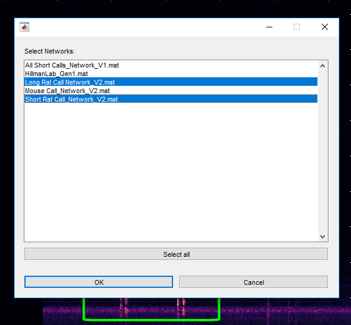

On the following screen, we can select a few more options regarding our audio files:
- **Total Analysis Length**: How many seconds of each video to scan through; I want the whole clip so I choose ```0```.
- **Analysis Chunk Length**: This allows us to have the network analyse larger chunks at once, but for now we'll stick with the default.
- **Overlap**: How much overlap is between each chunk, go with about the length of the longest call you're expecting, ```1``` is fine here.
- **Frequency Cut Offs**: The upper and lower bounds of the frequency range for your audio files, I just stick with defaults.
- **Score Threshold**: If we wanted to tigten things up to make sure we only get calls when the network is really sure it's a call (giving it a higher score), we could set a custom value, but since we're denoising later anyway, we'd still prefer to minimize **False Negatives** for now.
- **Append Date to Filename**: Because my audio files already have a nice naming convention, I'm going with No; ```0```.


After that, you'll be processing for a while. Depending on the computer you're using, how many files you're analyzing, what settings you selected; this could take minutes or hours. On a computer with a Nvidia 1050Ti 4GB, doing the single file I'm using in this example took about 10 minutes. As files complete, you'll see the number of calls detected show up in the Matlab Command Window, like ```2921 Calls found in: filename ```. You'll also notice after all the files are finished processing, your selected Detection folder will now have files in it; and the Detected Call Files list will have things in it now.

## Trimming our Sample Set

So we have a whole bunch of audio files analyzed with a *Hybrid* of two *Baseline* Networks on the *Recall* setting, all sitting in the ```Date-BaselineHybrid_Recall``` folder. While in the training process, I'd reccomend making a backup copy of these in case we need to refer back to it later. I duplicated mine into a folder you can see called ```Date-BaselineHybrid_Recall_Trimmed```, which I'm then going to load up with ```File > Select Detection Folder```:

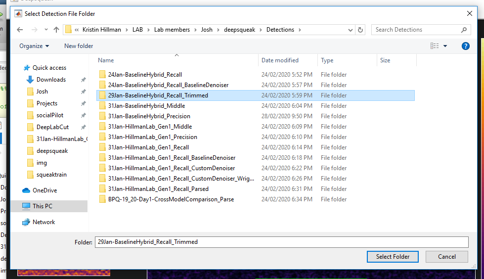

And we're going to start by just picking a Detected Call File on the right, and hitting ```Load Calls```, which should look something like this:

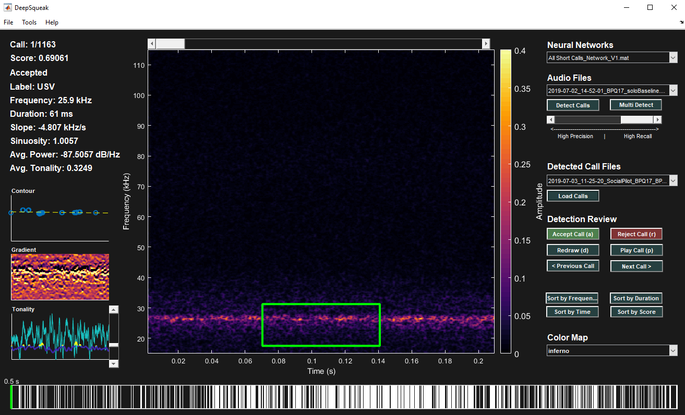

Some interesting things to look at here, in the top left and center mainly:
- **Call**: The number of the call you're looking at obviously, you can scroll through them with your arrow keys, or the ```Previous Call``` and ```Next Call``` buttons on the middle right.
- **Score**: This number represents how certain the network is that there is actually a call in the green box on the image; This number is a probability ranging from zero to one. The **Score Threshold** we looked at in the Multi-Detect options earlier refers to this number, such that any call that falls below the threshold you set, will be ignored instead.
- **Accepted**: This means that the network has "accepted" that there is a call in the box. All of the calls will have this flag at this stage.
- **Label: USV**: The label isn't really important here yet, as all of them will have been labelled as USVs.
- **Others**: Everything else is fairly intuitive data on the individual call.

Also distinctly noticeable in this image, is that the "call" that has been detected isn't actually a USV at all, it's some Noise, and we're going to hit the ```Reject Call``` button (or the ```R``` key). You'll notice that the flag turns to "Rejected", and the box turns red:


Now we'll hit ```Next Call >``` (or the ```Right Arrow``` Key). And in my case at least, the next call is also a **False Positive**, which I'm going to reject as well. We're rejecting these, so that when we use this file as a training sample, the network knows to use them as a "bad" example, and knows to ignore it. I'll be continuing doing this for the entire file until I hit some *real* calls; like this:


A real call! But it's not quite right; the box is clipping out some of it around the edges. Because whatever is inside the box is used as the reference "sample", we want to make sure that the box is nice and tightly encapsulating the whole call; to make sure our network is trained as well as possible. If we train our network on garbage, it's only going to identify garbage. So by pressing ```Redraw``` (or the ```D``` Key), and dragging a better box on the image, we can "trim" it up, like so:

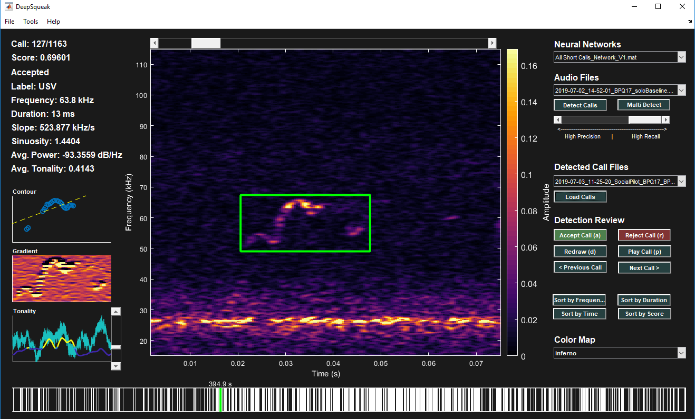

Continuing on through the file, there'll be many more calls that need trimming (either up *or* down), and we're going to do this for the whole file. And loading up more files and doing the same for them. I did this for 6 files, which honestly took a couple of days. 6 files in my case was enough to have a nice large sample that included each of my rats on 2 different days of testing each, as we're hoping to get a nice sample that includes many different types of calls; again to make things as generalizable as possible. Literally every single one can be seen in the ```Date-BaselineHybrid_Recall_Trimmed``` folder, which can be directly compared with ```Date-BaselineHybrid_Recall``` for a "before-after" kind of thing.

## Training a New Network

After you've got a few files trimmed, with all the bad calls rejected, and all the real calls trimmed up, we can actually train a new network! We head up to ```Tools > Network Training > Create Network Training Images```. We'll be prompted to select sample files to use, so we're going to select all of the files we just trimmed from the ```_Trimmed``` folder: 

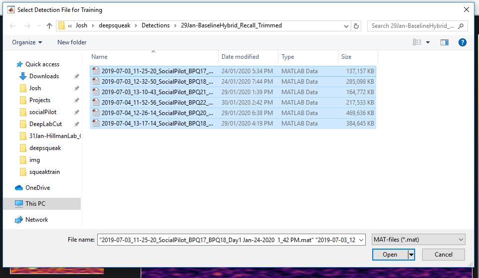

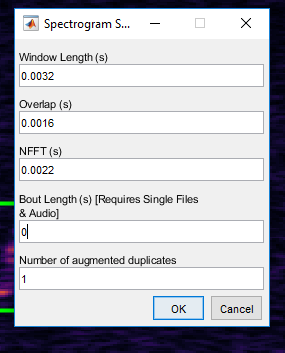

Right after that is the spectrogram settings, which I stick with the default settings of entirely with the exception of **Boat Length** which we have to change to ```0```, because we're doing multiple files. This'll take a little bit to do, but at the end you'll have created a set of image training table files. So next we'll go with ```Tools > Network Training > Train Detection Network```. This should put us straight in DeepSqueak's "Training" folder, in which we'll select all of the brand new mat files that have just been placed there: 

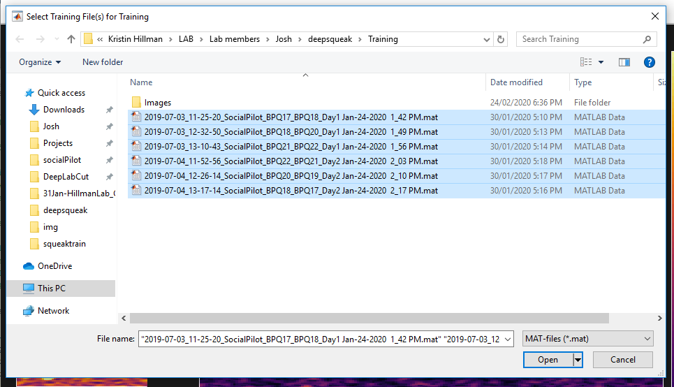

When asked if we want to base off an existing model, we'll select "No", and training will start. This will take quite a while, and will mostly take place in the Matlab Command Window; giving us updates on the four phases it goes through:

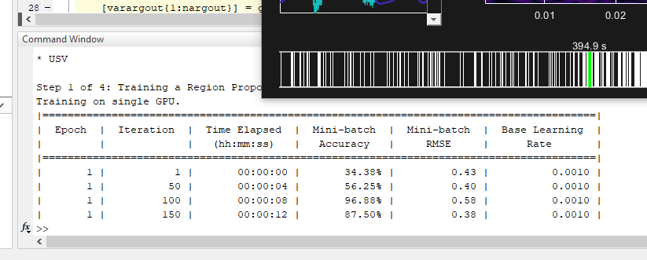

After all of this, once it's finished training, we'll be prompted to give our network an actual name and save it in the *Networks* folder; which I saved as ***HillmanLab_Gen1***. In theory now, this is the finished product of a network specifically trained against our own dataset. Indeed, this is exactly the network we'll be using, so let's throw it some files.

Just like before, we're going to:
 - Create a new Detection folder to output to: *HillmanLab_Gen1_Recall*.
 - Open it up in ```File > Select Detection Folder```
 - Set the Slider to *High Recall* - more on this again in a second
 - ```Multi Detect```, again picking all of the Audio files that we picked in the sample;
 - Same Settings, let it process.
 - You now have a set of fully Call Detected files.
 
### Why High Recall Again?

 - The Detection Network we just created is specialized at picking out **calls-amongst-noise**, but inevitably this comes with the large number of **False Positives** or **Noise**, which messes with our data. So we're going to create a Denoiser Network, which is specialized at picking out **noise-amongst-calls** and marking them as such, so that we can remove them. Think of this as using a large grain seive for the Detection Network - good at really getting out all the big long strips of nothing that our files are going to be full of, but let smaller patches of nothing slip through. Now a much finer grain seive for the Denoiser can be much more sensitive, specialized at very efficiently getting out the last little imperfections from a dataset that has *already* had the big chunks removed.
 - We pick High Recall because we'd rather be super generous and make sure we catch every *true positive*, and then filter out the **Noise** afterward with a precise denoiser. This is preferable to starting with Precsison and trimming out a bunch of good USVs that a Denoiser can't bring back. For demonstrating that this kind of "overpruning" is still a problem, I went through and did a similar check to the BaselineHybrid check, just seeing how many "true calls" are actually contained in each level of precision (featuring *BaselineHybrid_Recall* to show how much better our network is):
 
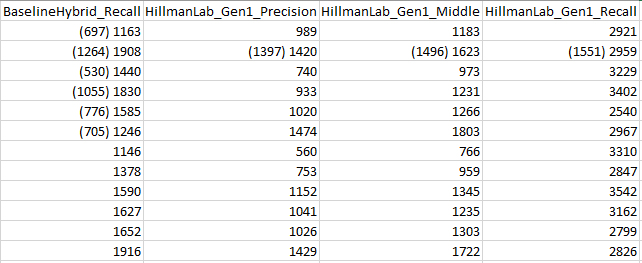

 - It's worth noting here that the *Precision* network is actually very close to hitting almost entirely "true" calls, suggesting it has very few **False Positives**. But when we compare it to the number of true calls in the *Recall* network, we see that it's missing around 150, which is over 10% of the calls (at least!), so it has many **False Negatives**. But of course, *Recall* comes with nearly double the number of total detections, suggesting it has a massive number of **False Positives**. Like with a haircut, it's easier to take more off than it is to put it back on
 
## Training a Denoiser

We're going to make a new copy of our nice new analyzed data from our Detection network, and put it in a new folder. So I now have a copy of ```HillmanLab_Gen1_Recall``` called ```HillmanLab_Gen1_Recall_Parsed```. When I open this up, I'm going to load up a Detected Call File just like before, and see a familiar looking scene:

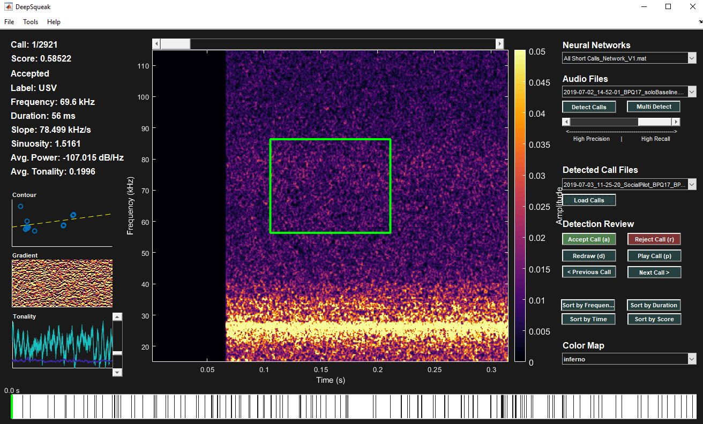

While most of the "true" calls in this file are pretty decent at getting boxes right, there's lots of just white noise like this which is being detected as a call. So we're going to ```Reject Call``` it again. But because the Denoising trainer actually relies on the Noise label, we need to set up our own labels - In ```Tools > Call Classification > Add Custom Labels```.

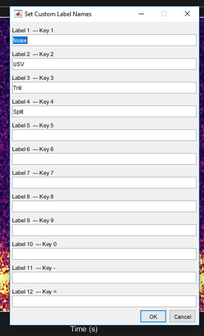

In here, we can set any labels we want to any of the number keys, such that when looking at a Detection, you press the corresponding number key; and it'll take on the label appointed to that slot. While this is also used for Call Classification training, we're only interested in Noise training, so we only need two labels: ```Noise```, and ```USV```, as shown above. Then we just hit ```OK```.

So now that we have that sorted, we should be able to just press the ```1``` Key, and we'll see that this has been updated to be both *Rejected*, and now has the label *Noise*. And we're going to go through this whole file like this just **Parsing**, which is to say we're only either having things *Rejected & Noise Flagged* **or** *Accepted & USV Flagged*, but we are ***NOT*** trimming any of the accepted USVs.


### Why Parsing, Why Not Trimming?

 - Another fair question would also be "why not just mark all those other calls we spent days doing as Noise at the same time?", and the answer is that our first dataset is for training a network to be as good at identifying random USVs spread across the file as a human. So for it to have trimmings & boxes that are similar to human accuracy, we need to train it on a dataset of human-marked USVs spread across a file. Monkey-See-Monkey-Do. 
  - This network isn't trying to do that though, this network isn't trying to be good at finding noise inside a human-marked file. This network is trying to be good at taking the **Noise/False Positives** out of a *computer-marked* file; so we need to feed it training sets that are representative of that: the ones generated by the same network it's going to be preceded by in "real" analysis. Our going through parsing the yes/no state of the file being generated by the computer is us training our network to be good at saying ye/no to the same type of thing.
  
### Continuing...
  
I think it's also important in this process of Accepting/Rejecting being very binary, that we have clear guideliness on what we count as an Accept; as it's not as simple as being able to readjust a non-perfect yes; We only have Yes and No. This is naturally somewhat subjective to what kind of testing you want to do.

In the case of the testing I'm working on, we're mainly concerned with just tagging the timestap of each call. Not so much about the type of call or frequency, those are somewhat secondary to the timing. And so my guidelines for accepting/rejecting are:
 - Accept even a partial corner of a call - we'd rather a partial hit than a full miss, as long as each little USV flag is set close enough to an actual call, that's the most important thing.
 - Reject calls that are "close-to" but not on a real call. We don't want to confuse the network or give it mixed signals based on things that aren't actually in the Box.
 - Reject white noise with no features.
 - Reject "Drop Spikes" and "Fan Noise" - for my recording environment specifically has a lot of background noise, which is luckily quite distinct from actual USVs, so we reject that easily.
 - Generally being rather generous with Accepting as long as there's something in the box that isn't just blatant white noise.
 
 So I went and did this Parsing process on the same 6 files that I did in the original Detection Network Training; Again this is quite a long process of just going through thousands of Detections, and either press ```1``` and ```R``` or clicking next. But at the end of all that, we can get the actual training going.
 
 When we train/use a Denoiser using DeepSqueak, the network used will **ALWAYS** be the file named *"CleaningNet.mat* inside the ```deepsqueak/Denoising Networks/``` folder. There'll be a default one included there right now, so we'll create a backup of that and place it inside there (I named my backup folder "DefaultCleaner"). Then we'll also create a new folder that we'll be making a backup of the new network in, like so:
 


Now back in the DeepSqueak window, we'll go to ```Tools > Network Training > Train Post Hoc Denoiser```. Here we'll select all the files we marked in the ```Date-HillmanLab_Gen1_Recall_Parsed```:

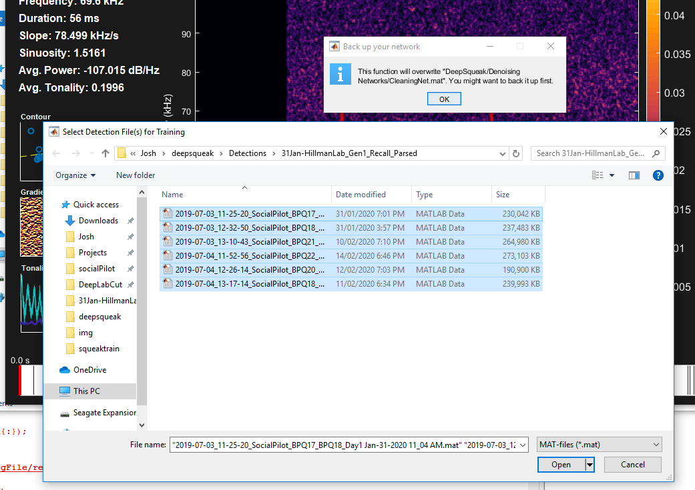

Training should start right away after confirming, and after all the files have loaded in, you'll see a progress window showing the training proccess, along with a matrix of the Error rate at the end:


Now we have a trained up Denoiser, so let's test it out. As usual though, backups first. Make another copy of the ```Date-HillmanLab_Gen1_Recall``` called ```Date-HillmanLab_Gen1_Recall_CustomDenoiser```, and change our Selected Detection Folder to that. We also need to make a copy of *"CleaningNet.mat"* from ```deepsqueak/Denoising Networks``` inside the "HillmanDenoiser" folder we created earlier; as *CleaningNet.mat* will now be overwritten from the original default network to our new Custom one.

Now back in the DeepSqueak window, we go ahead to ```Tools > Automatic Review > Post Hoc Denoising```, and select whatever files we want to Denoise, again using ```Ctrl``` or ```Shift``` to select multiples, after which training will start straight away:

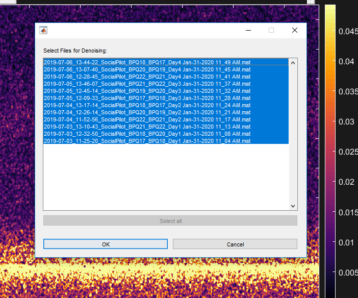

This should take a little while, especially if you've picked many files. After the training though, you should be able to load up a Detected Call File from the folder, and see that now it's automatically Rejected & Noise-Marked as if we had done it. Obviously there'll always be some amount of variability with getting a few **False Positives/Negatives**, however hopefully our Denoiser will have this at the lowest amount of variance possible. For reference, I went and used both my Custom Denoiser & the Default Denoiser (included with DeepSqueak), and compared them to the ```Date-HillmanLab_Gen1_Recall_Parsed``` below:

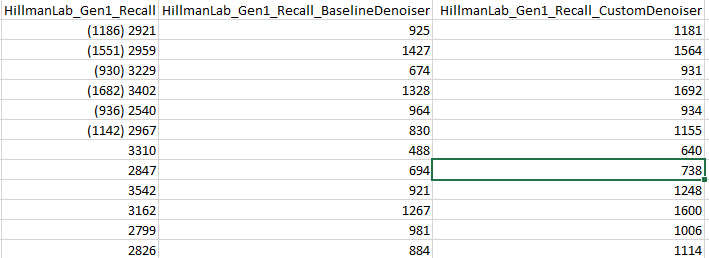

What I'm trying to demonstrate here again, is that the BaselineDenoiser (included with DeepSqueak) looks to be over-pruning out compared to the manual parse (shown in Brackets on the HillmanLab_Gen1_Recall column). Even if every single call that BaselineDenoiser got was correct (which it won't be), it's still cutting off at around 10% of the legitimate calls. Our CustomDenoiser on the other hand, has results that look extremely close even just numerically to the "true" number of legimate calls that I found. And while I didn't record the exact number of "true" calls inside the CustomDenoised files; On visual inspection (which you can see yourself in ```deepsqueak/Detections/Date-HillmanLab_Gen1_Recall_CustomDenoiser```, I'd call the difference a "matter of opinion" moreso than a flaw of the network. And considering the amount of time saved on manually marking each call for weeks, what looks at a glance to be sub-1% variance, we'll gladly take it.

## If you made it this far
Thanks for actually reading all of that, I hope it's enough to get people going with the basics of training up their own Detection & Denoising Networks on Deepsqueak. There'll be another shorter guide [here](./squeakbasic.md) on just how to actually use your Network for mass data analysis now, and if there are any errors or clarifications needed, I'm almost always available by email at joshwhitney789@gmail.com.
